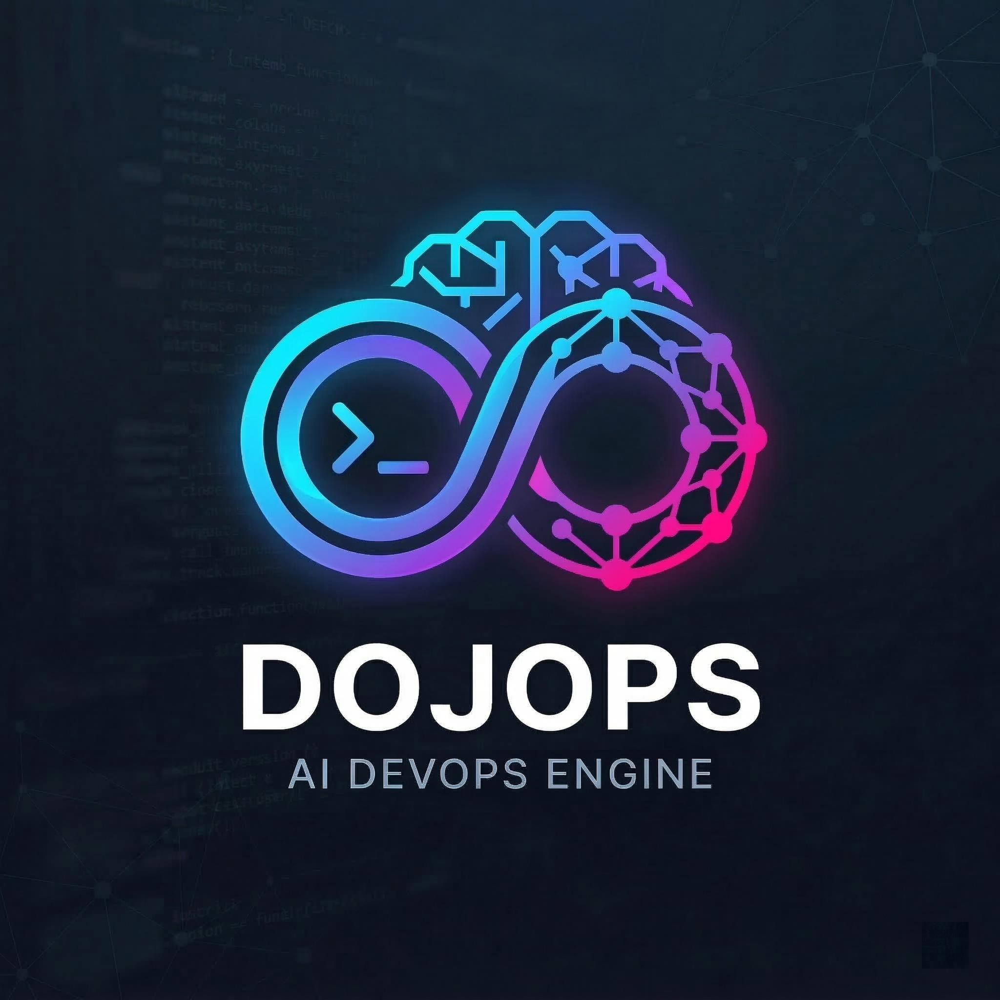
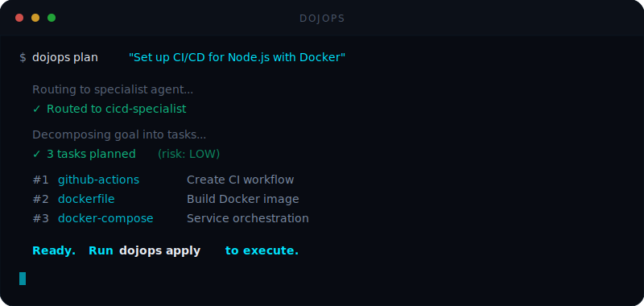

<p align="center">
  
</p>

<h1 align="center">DojOps</h1>

<p align="center">
  AI-powered DevOps config generation with validation, sandboxed execution, and audit logging.<br />
  Describe what you need in plain English. DojOps generates it, verifies it, and writes it safely.
</p>

<p align="center">
  <a href="#quick-start">Quick start</a> &nbsp;&middot;&nbsp;
  <a href="#features">Features</a> &nbsp;&middot;&nbsp;
  <a href="https://doc.dojops.ai">Docs</a> &nbsp;&middot;&nbsp;
  <a href="https://hub.dojops.ai">Skill hub</a> &nbsp;&middot;&nbsp;
  <a href="#contributing">Contributing</a>
</p>

<p align="center">
  <a href="https://www.npmjs.com/package/@dojops/cli"></a>
  <a href="https://www.npmjs.com/package/@dojops/cli"></a>
  <a href="https://github.com/dojops/dojops/actions/workflows/ci.yml"></a>
  <a href="https://github.com/dojops/dojops"></a>
  <a href="https://github.com/dojops/dojops/blob/main/LICENSE"></a>
  
  
</p>

<p align="center">
  <a href="https://sonarcloud.io/summary/new_code?id=dojops_dojops"></a>
</p>

<p align="center">
  
</p>

---

## Why DojOps?

Writing Terraform, Kubernetes, and CI/CD configs by hand is slow. Using an LLM to generate them is fast but risky: no schema enforcement, no execution controls, no audit trail. Compliance teams can't sign off on configs they can't verify.

DojOps sits between you and your LLM provider. It constrains output to Zod schemas, validates configs with external tools (terraform validate, hadolint, kubectl dry-run), writes files through a sandbox with approval gates, and logs every action to a tamper-proof audit chain.

---

## Quick start

```bash
# Install
npm i -g @dojops/cli

# Configure your LLM provider
dojops config

# Generate your first config
dojops "Create a Kubernetes deployment for nginx with 3 replicas"
```

<details>
<summary>Other install methods</summary>

```bash
# Homebrew (macOS / Linux)
brew tap dojops/tap && brew install dojops

# Shell script
curl -fsSL https://raw.githubusercontent.com/dojops/dojops/main/install.sh | sh

# Docker
docker run --rm -it ghcr.io/dojops/dojops "Create a Terraform config for S3"
```

</details>

See the [installation guide](https://doc.dojops.ai/getting-started/installation) for more.

---

## How it works

```bash
# Describe what you need
dojops "Create a Terraform config for S3 with versioning"

# Break complex goals into task graphs
dojops plan "Set up CI/CD for a Node.js app"

# Execute with approval workflow
dojops apply

# Web dashboard + REST API
dojops serve
```

Your prompt gets routed to the right specialist agent. The LLM output is locked to a Zod schema, validated by external tools, then written to disk through the sandbox. If something fails mid-plan, `dojops apply --resume` picks up where it left off.

---

## Features

17 specialist agents cover Terraform, Kubernetes, CI/CD, security, Docker, cloud architecture, and more. You can create custom agents with `dojops agents create`. Six LLM providers are supported: OpenAI, Anthropic, Ollama (local), DeepSeek, Google Gemini, and GitHub Copilot. Switch providers mid-session with `/provider`.

18 built-in skills handle GitHub Actions, Terraform, Kubernetes, Helm, Ansible, Docker Compose, Dockerfile, Nginx, Makefile, GitLab CI, Prometheus, Systemd, Jenkinsfile, Grafana, CloudFormation, ArgoCD, Pulumi, and OpenTelemetry Collector. Write your own as `.dops v2` manifests and share them on the [DojOps Hub](https://hub.dojops.ai).

`dojops auto` reads your project, plans changes, writes code, runs verification, and self-repairs on failure in an iterative tool-use loop. Run it in the background with `--background` and check results later with `dojops runs`.

Extend DojOps with external tools via the [Model Context Protocol](https://modelcontextprotocol.io). Connect any MCP server (stdio or HTTP) with `dojops mcp add`. Tools are automatically discovered and available to the agent loop.

LLM responses stream to the terminal in real time. Use `--voice` to dictate prompts via local whisper.cpp, fully offline.

Complex goals get decomposed into dependency-aware task graphs with risk classification and parallel execution. File writes are atomic, restricted to infrastructure paths, and backed up automatically. You see a diff preview before every write. Failed plans can be resumed without re-running completed tasks.

10 scanners run before configs go live: Trivy, Gitleaks, Checkov, Semgrep, Hadolint, ShellCheck, npm/pip audit, SBOM generation, and license scanning. Configs are also validated by external tools before anything is written.

DojOps remembers project context across sessions. Notes, error patterns, and task history are stored locally and automatically injected into LLM context when relevant. Toggle with `dojops memory auto`.

Every action is recorded in a hash-chained JSONL log with SHA-256 integrity verification. The policy engine controls which paths are writable, enforces timeouts and file size limits, and restricts environment variable access.

21 REST endpoints expose everything over HTTP. The web dashboard shows metrics, agents, execution history, and security findings. Run `dojops serve` to start it.

Nothing leaves your machine except requests to your chosen LLM provider.

Full details in the [documentation](https://doc.dojops.ai).

---

## Architecture

```
@dojops/cli            CLI entry point, terminal UI
@dojops/api            REST API (Express), web dashboard
@dojops/skill-registry Skill registry, custom skill/agent discovery
@dojops/planner        Task graph decomposition, topological executor
@dojops/executor       Sandbox, policy engine, approval, audit log
@dojops/runtime        18 built-in DevOps skills (.dops v2)
@dojops/scanner        10 security scanners, remediation
@dojops/mcp            MCP server connections, tool discovery
@dojops/context        Context7 documentation augmentation
@dojops/session        Chat session management, memory
@dojops/core           LLM abstraction (6 providers), 17 specialist agents
@dojops/sdk            BaseSkill<T>, Zod validation, file utilities
```

```
cli -> api -> skill-registry -> runtime -> core -> sdk
          -> planner -> executor
          -> scanner
          -> mcp -> core
          -> context -> core
          -> session -> core
```

See [docs/architecture.md](docs/architecture.md) for the full design.

---

## Development

```bash
git clone https://github.com/dojops/dojops.git
cd dojops
pnpm install
pnpm build              # Build all 12 packages via Turbo
pnpm test               # Run all tests
pnpm lint               # ESLint across all packages

# Per-package
pnpm --filter @dojops/core test

# Run locally without global install
pnpm dojops -- "Create a Terraform config for S3"
```

Requires Node.js >= 20 and pnpm >= 8.

---

## Privacy

DojOps does not collect telemetry. No project data leaves your machine
except to your configured LLM provider. Generated configs, audit logs,
and scan reports all stay in your local `.dojops/` directory.

---

## Contributing

See the [contributing guide](docs/contributing.md) for setup, coding standards, and how to add skills and agents.

1. Fork the repository
2. Create a feature branch (`git checkout -b feature/my-feature`)
3. Make your changes with tests
4. Run `pnpm test && pnpm lint`
5. Submit a pull request

---

## License

[MIT](LICENSE)
